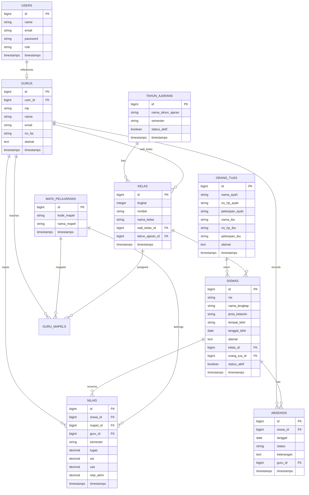

# Arsitektur Sistem Informasi Sekolah

## 1. Stack

- Backend: Laravel API + Sanctum
- Frontend: Nuxt 3 + Pinia + TailwindCSS
- Database: PostgreSQL

## 2. Folder Structure

```text
backend/
├── app/
│   ├── Http/
│   │   ├── Controllers/Api
│   │   ├── Middleware
│   │   ├── Requests
│   │   └── Resources
│   ├── Models
│   ├── Repositories
│   └── Services
├── database/
│   ├── migrations
│   └── seeders
├── routes/
│   └── api.php
└── README.md

frontend/
├── assets/
├── components/
├── composables/
├── layouts/
├── middleware/
├── pages/
├── plugins/
├── stores/
├── types/
└── README.md
```

## 3. ERD



## 4. Role Permission

### Admin

- Full CRUD semua master data
- Lihat semua laporan
- Kelola akun guru
- Kelola kelas dan wali kelas

### Guru

- Login/logout
- Input absensi
- Input nilai
- Lihat siswa sesuai kelas yang diajar
- Lihat dashboard personal

## 5. Authentication Flow

1. User login via `POST /api/auth/login`
2. Laravel Sanctum membuat token
3. Frontend simpan token pada cookie/http-only strategy atau storage aman
4. Middleware frontend + backend validasi auth
5. Middleware role membatasi akses endpoint

## 6. REST API MVP

### Auth

- `POST /api/auth/login`
- `POST /api/auth/logout`
- `GET /api/auth/me`

### Dashboard

- `GET /api/dashboard/admin`
- `GET /api/dashboard/guru`

### Master Data

- `GET|POST /api/students`
- `GET|PUT|DELETE /api/students/{id}`
- `GET|POST /api/parents`
- `GET|PUT|DELETE /api/parents/{id}`
- `GET|POST /api/teachers`
- `GET|PUT|DELETE /api/teachers/{id}`
- `GET|POST /api/classes`
- `GET|PUT|DELETE /api/classes/{id}`
- `GET|POST /api/academic-years`
- `GET|PUT|DELETE /api/academic-years/{id}`
- `GET|POST /api/subjects`
- `GET|PUT|DELETE /api/subjects/{id}`

### Absensi

- `GET /api/attendances`
- `POST /api/attendances/bulk`
- `GET /api/attendances/recap`

### Nilai

- `GET /api/grades`
- `POST /api/grades`
- `PUT /api/grades/{id}`
- `GET /api/grades/recap`

### Rapot

- `GET /api/report-cards/{studentId}`
- `GET /api/report-cards/{studentId}/pdf`

## 7. Flow Sistem

### Admin

1. Login
2. Setup tahun ajaran aktif
3. Input guru
4. Input kelas dan assign wali kelas
5. Input orang tua
6. Input siswa dan assign kelas
7. Input mapel
8. Pantau dashboard dan laporan

### Guru

1. Login
2. Pilih kelas
3. Input absensi harian
4. Input nilai per mapel
5. Review rekap nilai dan rapot

## 8. UI Concept

- Sidebar navigation modern
- Header ringkas + profile menu
- Card statistik
- Table dengan search, filter, pagination
- Form modal/drawer
- Dark mode opsional

## 9. Best Practice

- Pisahkan domain per modul
- Gunakan Form Request untuk validasi
- Gunakan API Resource untuk output konsisten
- Simpan business logic di service layer
- Gunakan query filter object untuk listing kompleks
- Siapkan enum untuk role, status absensi, semester

## 10. Roadmap

### Phase 1

- Setup auth
- Master data
- Dashboard dasar

### Phase 2

- Absensi
- Penilaian
- Rapot PDF

### Phase 3

- Import/export Excel
- Grafik dashboard
- Multi tahun ajaran
- QR absensi
- Notifikasi WhatsApp
